# template-tinyfpga <!-- omit in toc -->

- [gpio](#gpio)
- [pwm](#pwm)
- [uart](#uart)
- [ram](#ram)
- [spirom](#spirom)
- [random](#random)
- [counter](#counter)
- [oscilator](#oscilator)
- [mixier](#mixier)
- [spidac](#spidac)

## [gpio](.packages/gpio/)

- `void mode(Mode)`
  - `Mode::IN`
  - `Mode::OUT`
- `uint32_t read()`
- `void write(uint32_t)`

## [pwm](.packages/pwm/)

- `void duty(uint32_t)`

## [uart](.packages/uart/)

**`Serial`**

**`MIDI`**

## [ram](.packages/ram/)

## [spirom](.packages/spirom/)

**`ROM_CFG`**

- `void dual_io()`

## [random](.packages/random/)

32bit LFSR : 32,22,2,1

参考：http://zakii.la.coocan.jp/signal/41_lfsr.htm

## [counter](.packages/counter/)

## [oscilator](.packages/oscilator/)

## [mixier](.packages/mixier/)

8bit 入力をシフトして加算します．
出力は上位 12 ビットを見ます．

**`Mixier`**

- `void set_vol(uint32_t ch, uint32_t vol)`

## [spidac](.packages/spidac/)
